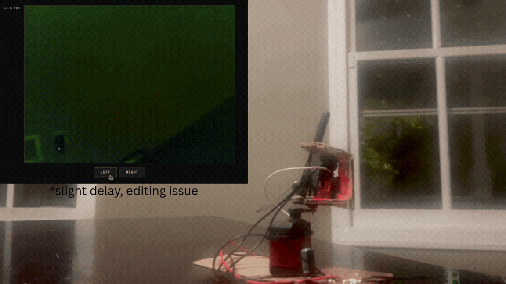

# ESP-CAM



A wireless camera system built on the ESP32-CAM with a browser-based interface for live MJPEG streaming, servo control, and session-based authentication. Written in C++ using ESP-IDF.

## Features

- Live MJPEG stream served over WiFi, viewable in any browser
- Session-based login with configurable username, password, and session token
- Pan control via a servo motor driven by HTTP commands from the web UI
- Real-time FPS counter displayed alongside the stream
- mDNS hostname (`esp-server.local`) so no IP lookup is needed
- Static web UI (HTML) stored on a SPIFFS partition

## Architecture

Two HTTP servers run concurrently:

| Server | Port | Routes |
|--------|------|--------|
| Main | 80 | `/` — web UI, `/auth` — login, `/servo` — pan control, `/fps` — frame rate |
| Stream | 81 | `/stream` — MJPEG video stream |

The stream server runs its MJPEG loop independently. The main server handles all other requests including the `/fps` endpoint, which reads a global updated by the stream loop on each frame.

## Hardware

- ESP32-CAM (AI-Thinker)
- SG90 servo on GPIO 14 (pan axis)

## Configuration

Credentials and WiFi are set via `idf.py menuconfig` before flashing:

```
Wifi Credentials
  wifi_name       → your SSID
  wifi_password   → your password

Camera Auth
  cam_username    → login username
  cam_password    → login password
  cam_session_token → session cookie value
```

## Flash & Run

```bash
idf.py build
idf.py flash monitor
```

After boot the device connects to WiFi and registers itself as `esp-server.local`. Open a browser and navigate to `http://esp-server.local` to access the interface.

The stream is available directly at `http://esp-server.local:81/stream`.
